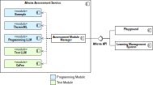

Athena
==========

List of Modules
----------------

.. list-table::
   :widths: 15 10 75
   :header-rows: 1

   * - Module
     - Type
     - Description
   * - ``module_example``
     - Programming
     - Contains a simple example of a module, which can be used as a template for
       new modules. It is only used for testing purposes.
   * - ``module_programming_themisml``
     - Programming
     - The module uses ANTLR47 and CodeBERT for parsing submissions and identifying feedback methods, 
       and refines feedback through filters, flagging overly generic feedback and reinstating valid 
       feedback when similar suggestions recur for the same method.
   * - ``module_programming_llm``
     - Programming 
     - Employs large language models to generate context-specific feedback for programming
       exercises by integrating elements like file-specific problem statements, grading instructions, 
       and submission files, following a workflow of formatting prompts, predicting, and parsing 
       feedback suggestions.
   * - ``module_text_llm``
     - Text
     - Large language model based feedback suggestions using a three-step workflow of formatting prompts with 
       rich context, predicting and parsing feedback suggestions, managing token limits by omitting parts of 
       input. Additionally, it incorporates an LLM-as-a-judge approach for automatic evaluation of suggestions.
   * - ``module_text_cofee``
     - Text
     - CoFee is a machine learning-based approach that automates grading by employing topic modeling, 
       segment-based grading, and hierarchical clustering to suggest feedback, significantly reducing 
       grading effort by identifying groups of similar text segments for efficient and precise feedback 
       generation.

System Design
-------------

    Subsystem decomposition of Athena
