Playground
==========

Welcome to the Athena Playground Interface, a versatile tool designed for developing, testing, and evaluation Athena modules. This document provides an overview of the Playground's features, illustrating its capabilities and how to use them effectively.

Base Configuration
------------------

The Base Configuration section is your starting point in the Athena Playground. Here, you connect to the Athena instance, monitor the health status of Athena and its modules, and set up your working environment. You can switch between example and evaluation datasets, and choose between Module Requests and Evaluation Mode for varied testing experiences.

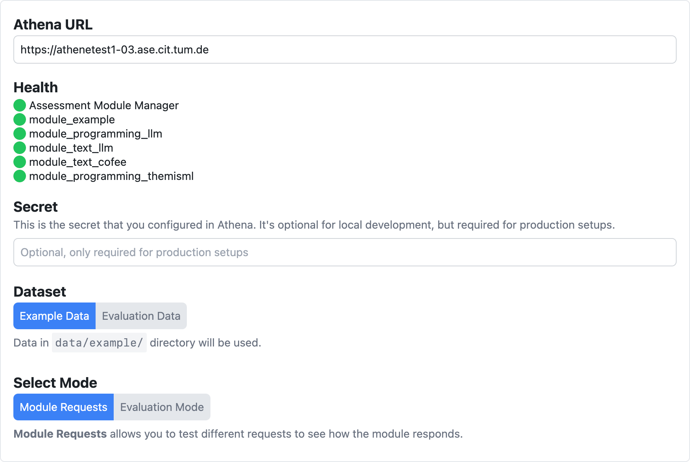

    Base Info Header Interface of the Athena Playground

.. raw:: html

    <iframe src="https://live.rbg.tum.de/w/artemisintro/40949?video_only=1&t=0" allowfullscreen="1" frameborder="0" width="600" height="350">
        Video version of Athena_BaseInfoHeader on TUM-Live.
    </iframe>

Module Requests
---------------

This section is designed to test individual requests to Athena modules, allowing you to observe and understand their responses in isolation. First, select a healthy module from the dropdown menu. Then, you can optionally choose to use a custom configuration for all subsequent requests. Afterward, you can test the following requests.

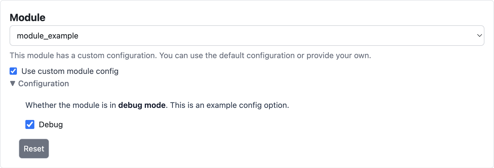

    Module Requests: Select Module Interface of the Athena Playground

Get Config Schema
^^^^^^^^^^^^^^^^^

This feature enables you to fetch and view the JSON configuration schema of a module. It's a critical tool for understanding the expected runtime configuration options for different modules, ensuring seamless integration and functioning with your system.

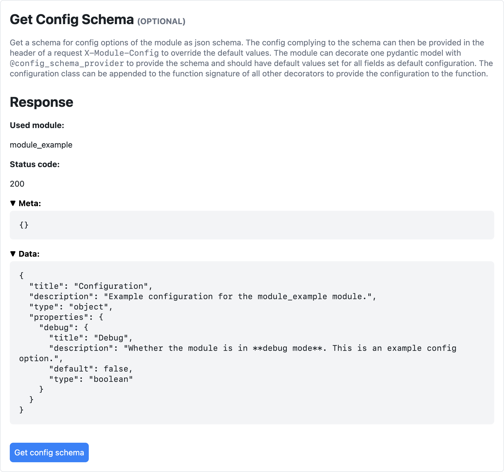

    Module Requests: Get Config Schema Request Interface of the Athena Playground

.. raw:: html

    <iframe src="https://live.rbg.tum.de/w/artemisintro/40950?video_only=1&t=0" allowfullscreen="1" frameborder="0" width="600" height="350">
        Video version of Athena_GetConfigSchema on TUM-Live.
    </iframe>

Send Submissions
^^^^^^^^^^^^^^^^

Send Submissions is a key feature for pushing exercise materials and submissions to Athena modules. It's a foundational step, allowing modules to process and analyze data for later.

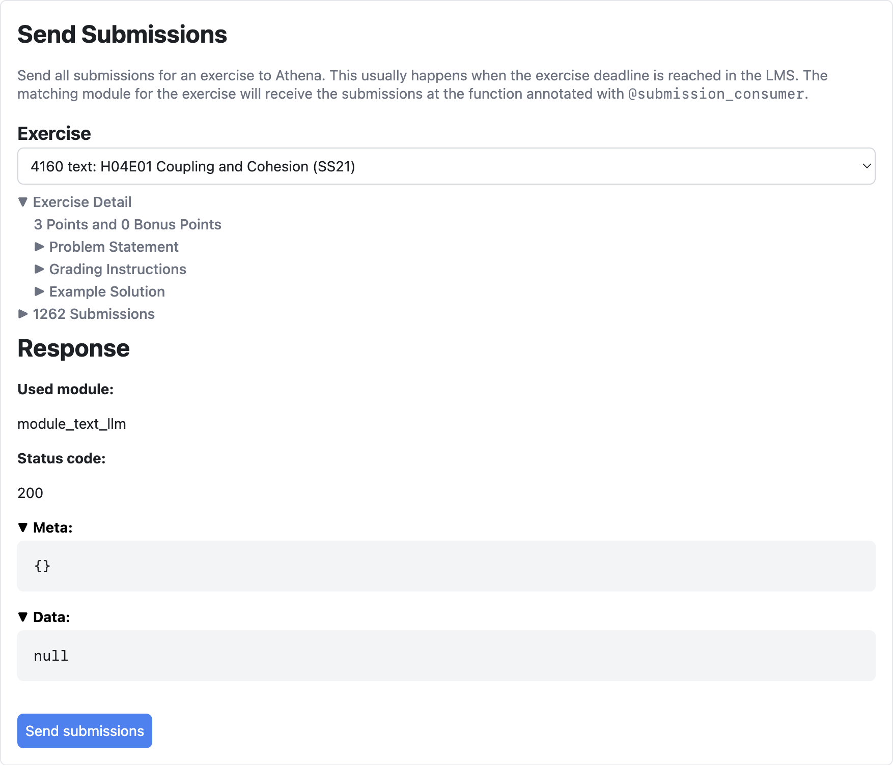
    
    Module Requests: Send Submissions Request Interface of the Athena Playground

.. raw:: html

    <iframe src="https://live.rbg.tum.de/w/artemisintro/40951?video_only=1&t=0" allowfullscreen="1" frameborder="0" width="600" height="350">
        Video version of Athena_SendSubmissions on TUM-Live.
    </iframe>

Select Submission
^^^^^^^^^^^^^^^^^

Selecting submissions is crucial for improving the efficiency of generated feedback suggestions. This feature allows modules to propose a specific submissions, which can then be used to generate feedback suggestions. For instance, CoFee uses this to select the submission with the highest information gain so it can generate more relevant feedback suggestions for the remaining submissions.

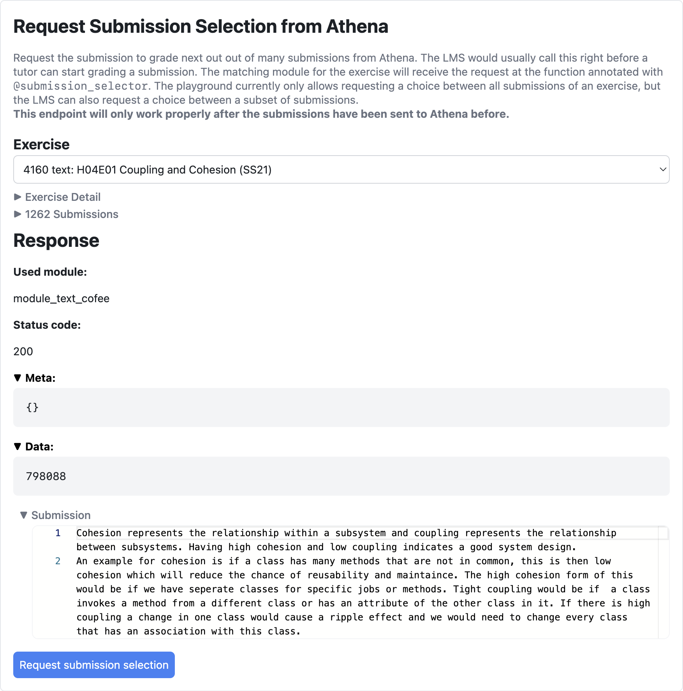
    
    Module Requests: Select Submission Request Interface of the Athena Playground

.. raw:: html

    <iframe src="https://live.rbg.tum.de/w/artemisintro/40952?video_only=1&t=0" allowfullscreen="1" frameborder="0" width="600" height="350">
        Video version of Athena_SelectSubmission on TUM-Live.
    </iframe>

Send Feedback
^^^^^^^^^^^^^

Send Feedback enables the transmission of (tutor) feedback to Athena modules. This feature is pivotal in creating a learning loop, where modules can refine their responses based on real feedback.

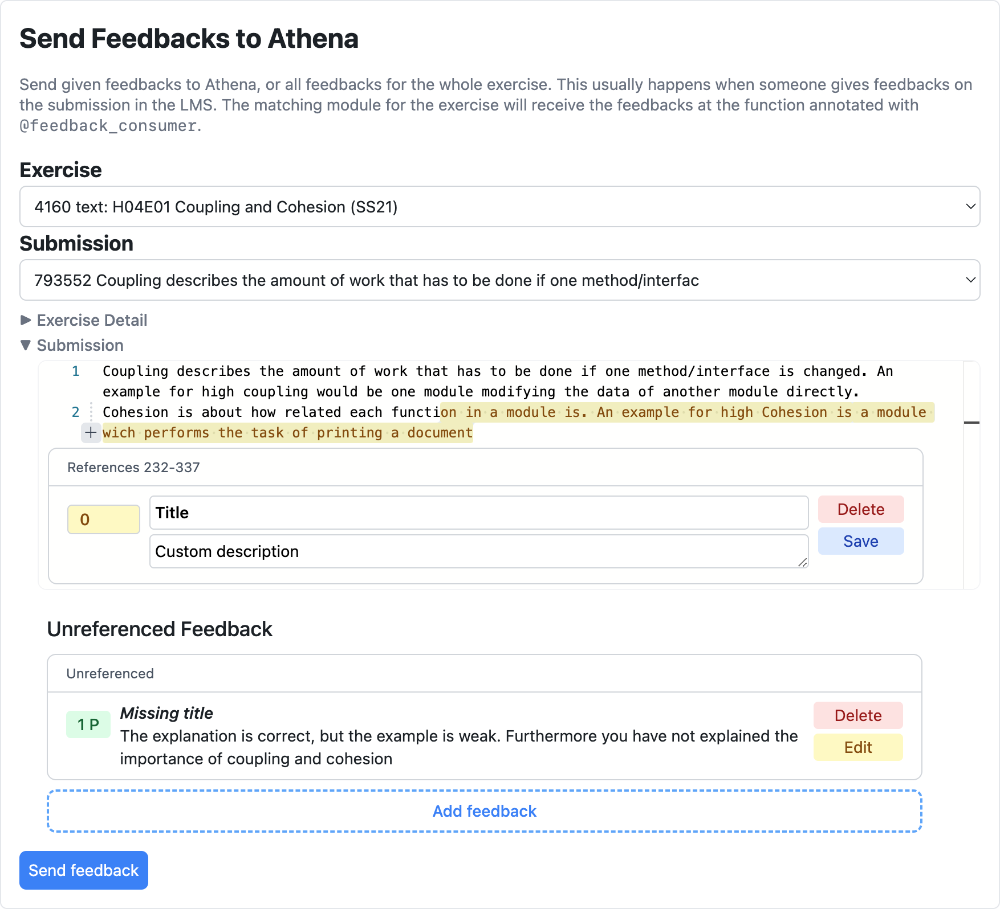

    Module Requests: Send Feedback Request Interface of the Athena Playground
    
.. raw:: html

    <iframe src="https://live.rbg.tum.de/w/artemisintro/40954?video_only=1&t=0" allowfullscreen="1" frameborder="0" width="600" height="350">
        Video version of Athena_SendFeedback on TUM-Live.
    </iframe>

Generate Feedback Suggestions
^^^^^^^^^^^^^^^^^^^^^^^^^^^^^

This function is at the heart of Athena's feedback mechanism. It responds with generated feedback suggestions for a given submission.

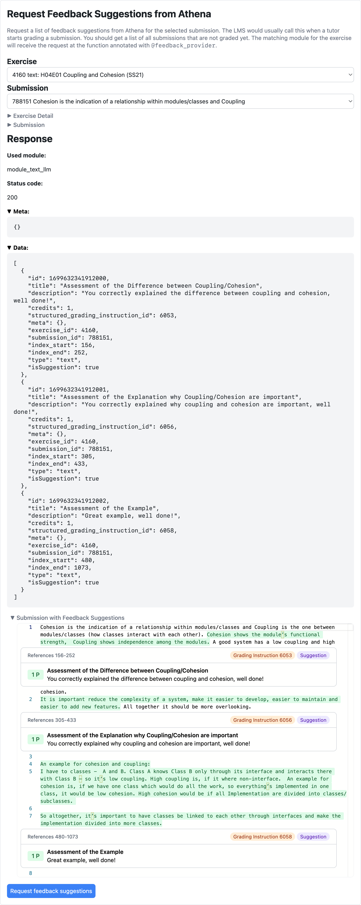

    Module Requests: Generate Feedback Suggestions Request Interface of the Athena Playground
   
.. raw:: html

    <iframe src="https://live.rbg.tum.de/w/artemisintro/40955?video_only=1&t=0" allowfullscreen="1" frameborder="0" width="600" height="350">
        Video version of Athena_GenerateSuggestions on TUM-Live.
    </iframe>

Request Evaluation
^^^^^^^^^^^^^^^^^^

Request Evaluation is essential for assessing the quality of feedback provided by Athena modules. It allows the comparison between module-generated feedback and historical tutor feedback, offering a quantitative analysis of the module's performance.

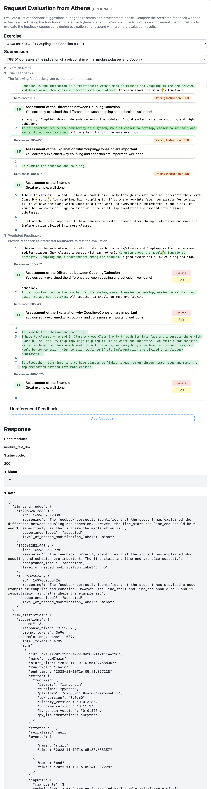

    Module Requests: Evaluation Request Interface of the Athena Playground
    
.. raw:: html

    <iframe src="https://live.rbg.tum.de/w/artemisintro/40956?video_only=1&t=0" allowfullscreen="1" frameborder="0" width="600" height="350">
        Video version of Athena_Evaluation on TUM-Live.
    </iframe>

Evaluation Mode
---------------

Evaluation Mode enables comprehensive evaluation and comparison of different modules through experiments.

Define Experiment
^^^^^^^^^^^^^^^^^

Define Experiment allows you to set up and customize experiments. You can choose execution modes, exercise types, and manage training and evaluation data, laying the groundwork for in-depth structured module comparison and analysis. Experiments can be exported and imported, allowing you to reuse and share them with others as benchmarks.

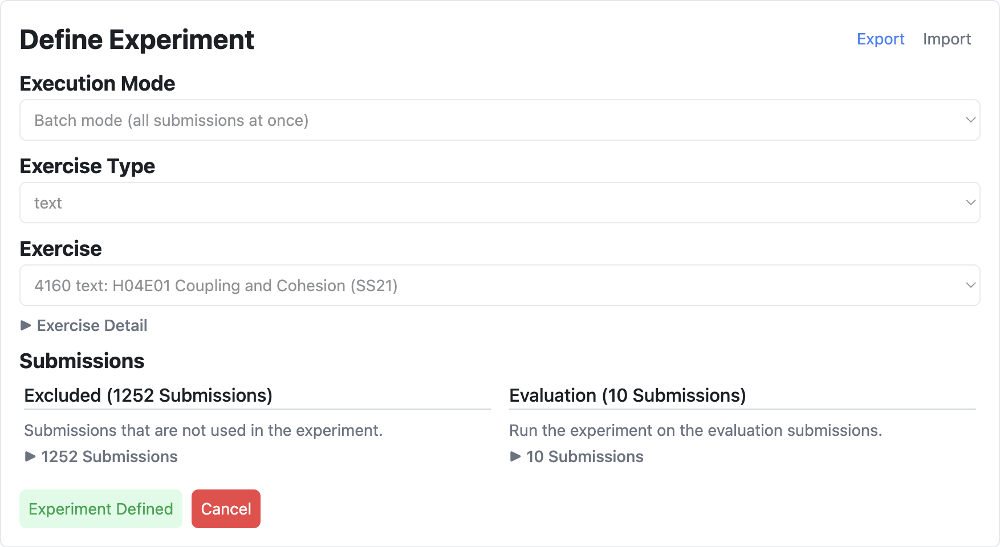

    Evaluation Mode: Define Experiment Interface of the Athena Playground

.. raw:: html

    <iframe src="https://live.rbg.tum.de/w/artemisintro/40957?video_only=1&t=0" allowfullscreen="1" frameborder="0" width="600" height="350">
        Video version of Athena_DefineExperiment on TUM-Live.
    </iframe>

Configure Modules
^^^^^^^^^^^^^^^^^

Here, you can select and configure the modules for your experiment. This step is crucial for ensuring that each module is set up with the appropriate parameters for effective comparison and analysis. Module configurations can be exported and imported, allowing you to reuse them in other experiments and share them with others for reproducibility.

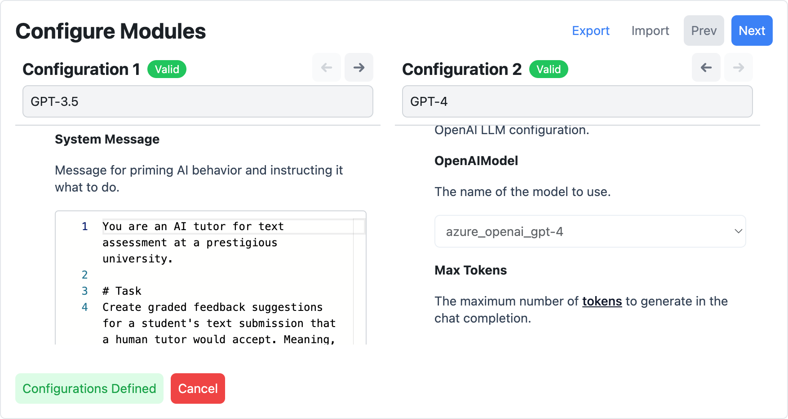

    Evaluation Mode: Configure Modules Interface of the Athena Playground

.. raw:: html

    <iframe src="https://live.rbg.tum.de/w/artemisintro/40959?video_only=1&t=0" allowfullscreen="1" frameborder="0" width="600" height="350">
        Video version of Athena_ConfigureModules on TUM-Live.
    </iframe>

Conduct Experiment
^^^^^^^^^^^^^^^^^^

You can conduct experiments with modules on exercises. This feature allows you to analyze module performance in generating and evaluating feedback on submissions. The interface is column-based, with the first column displaying the exercise details, the second column displaying the selected submission with historical feedback, and the next columns displaying the generated feedback suggestions from each module.

Currently, only the batch mode is supported, where all submissions are processed at once and the following steps are performed:
1. Send submissions
2. Send feedback for training submissions if there are any
3. Generate feedback suggestions for all evaluation submissions
4. Run automatic evaluation

Additionally, you can annotate the generated feedback suggestions like a tutor would do in the Artemis interface with: ``Accept`` or ``Reject``.

The ``results``, ``manual ratings``, and ``automatic evaluation`` can be exported and imported, allowing you to analyze and visualize the results in other tools, or continue the experiment at a later time.

For Text Exercises
""""""""""""""""""

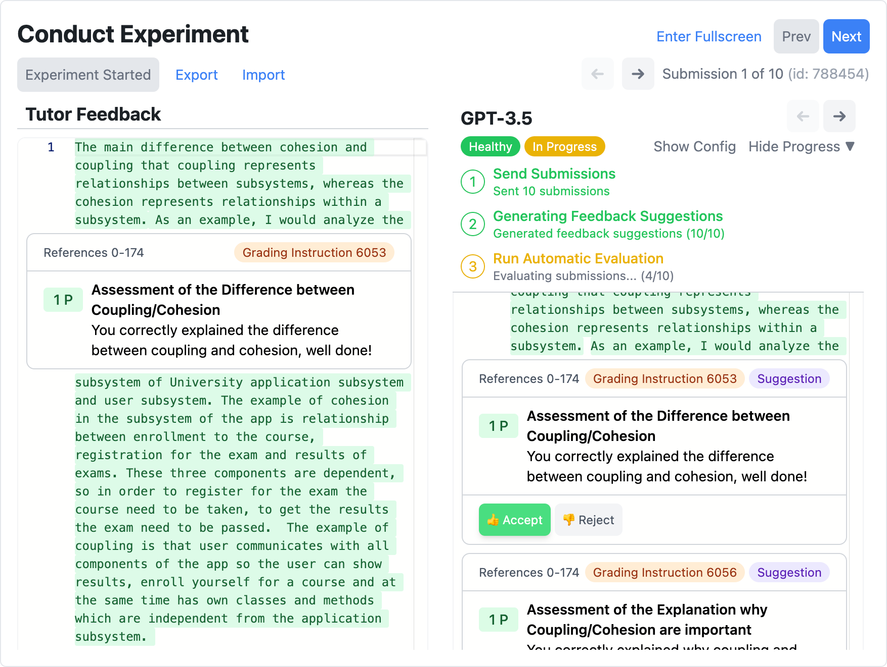

    Evaluation Mode: Conduct Experiment Interface for a Text Exercise of the Athena Playground

.. raw:: html

    <iframe src="https://live.rbg.tum.de/w/artemisintro/40960?video_only=1&t=0" allowfullscreen="1" frameborder="0" width="600" height="350">
        Video version of Athena_ConductExperimentText on TUM-Live.
    </iframe>

For Programming Exercises
"""""""""""""""""""""""""

.. raw:: html

    <iframe src="https://live.rbg.tum.de/w/artemisintro/40961?video_only=1&t=0" allowfullscreen="1" frameborder="0" width="600" height="350">
        Video version of Athena_ConductExperimentProgramming on TUM-Live.
    </iframe>
    