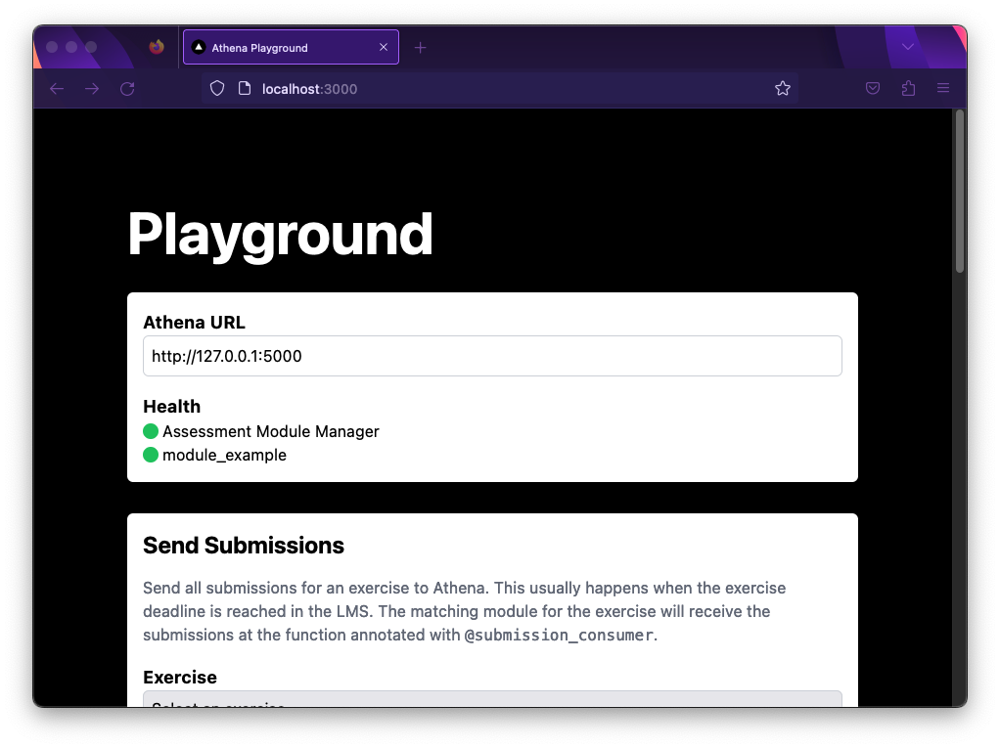

Run the Playground
===========================================

Athena includes a playground that allows you to run and test your modules and queries.
The playground is a web application built with `Next.js <https://nextjs.org/>`_.
To run the playground, run the following command in the ``playground`` folder:

    .. code-block:: bash

        npm install
        npm run dev

You can reach the playground at http://localhost:3000.

