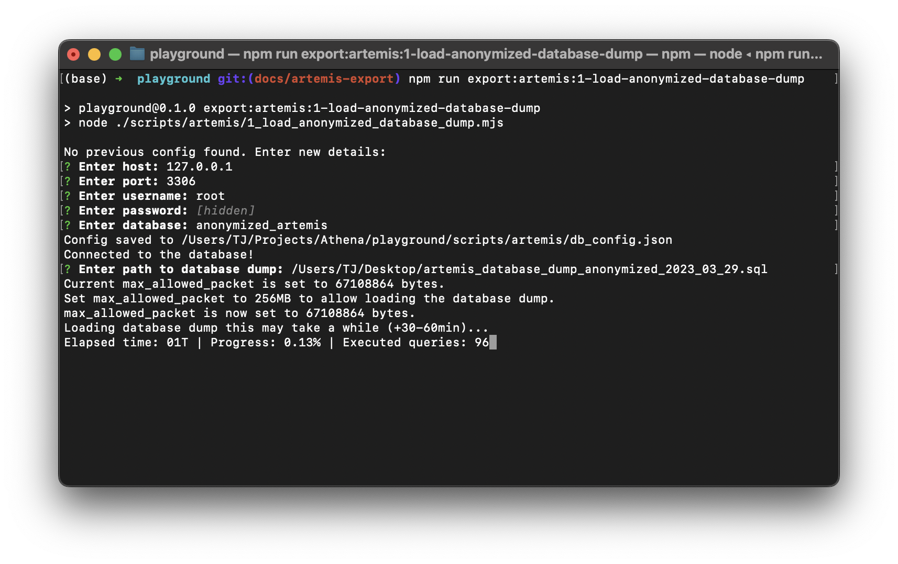

Evaluation Data for Athena Playground
===========================================

The Athena Playground is equipped with a set of example data for initial testing. To conduct a more thorough evaluation, users have the option to use their own datasets or request anonymized data from `Artemis <https://github.com/ls1intum/Artemis>`_, an open-source LMS.

Example Data
------------

Located in ``playground/data/example``, this default dataset is automatically used when the Playground is initiated.

Evaluation Data
---------------

The directory ``playground/data/evaluation`` is reserved for your custom data. It is initially empty, ready to be filled with your evaluation datasets.

Exporting Evaluation Data from Artemis
^^^^^^^^^^^^^^^^^^^^^^^^^^^^^^^^^^^^^^

To evaluate using data from Artemis, you can request an anonymized database dump, contingent on a valid justification and a signed data protection agreement. Contact the Artemis team for details.

Steps to Export Evaluation Data from Artemis:
"""""""""""""""""""""""""""""""""""""""""""""

1. **Setup a MySQL database:**
   Create a new MySQL database and user. You can use the same database instance as Artemis or a separate one. You can follow the instructions in the `Artemis documentation <https://docs.artemis.cit.tum.de/dev/setup/database.html#mysql-setup>`_ to set up a MySQL database.

2. **Load the Database Dump:**
   Use the command below to import the anonymized data into your local MySQL database. You will only need to do this once to populate the database. The script will ask you for the database ``host``, ``port``, ``user``, ``password``, and ``database``. Additionally, you will need to provide the path to the anonymized database dump, e.g. ``/home/user/artemis-database-dump.sql``.

   .. code-block:: bash

       npm run export:artemis:1-load-anonymized-database-dump

3. **Export the Data:**
   This command exports the data specified in ``playground/scripts/artemis/evaluation_data/text_exercises.json`` to your local ``playground/data/evaluation`` directory.

   .. code-block:: bash

       npm run export:artemis:2-export-evaluation-data

To evaluate using data from Artemis, you can request an anonymized database dump, contingent on a valid justification and a signed data protection agreement. Contact the Artemis team for details.

Steps to Export Evaluation Data from Artemis:

1. **Load the Database Dump:**
    Use the command below to import the anonymized data into your local MySQL database.

    .. code-block:: bash

        npm run export:artemis:1-load-anonymized-database-dump

    This command loads the data into your local MySQL database. You can use the same database as Artemis.

2. **Export the Data:**

    .. code-block:: bash

        npm run export:artemis:2-export-evaluation-data

Artemis Programming Exercises
^^^^^^^^^^^^^^^^^^^^^^^^^^^^^

Programming exercises are not part of the anonymized database dump and must be requested separately from the Artemis team. You can find the selected exercise and their participation IDs for export in ``playground/scripts/artemis/evaluation_data/programming_exercises.json``.

Steps for Instructors to Export Programming Exercises:
""""""""""""""""""""""""""""""""""""""""""""""""""""""

1. **Download Repositories:**
   Instructors can download materials and submissions from Artemis using the command below, then zip and transfer them to you. Keep in mind that this command will take a long time to run if there are many participations to download.

   .. code-block:: bash

       npm run export:artemis:3-download-programming-repositories

2. **Link the Repositories:**
   Put the downloaded repositories in the ``playground/data/evaluation`` directory and link them to the respective exercises using the following command. This command will also validate if there are any missing repositories. Without this step, the programming repositories will not be available in the Playground.

   .. code-block:: bash

       npm run export:artemis:4-link-programming-repositories

Generating ``programming_exercises.json``
^^^^^^^^^^^^^^^^^^^^^^^^^^^^^^^^^^^^^^^^^

The SQL script provided below can be adapted to generate a ``programming_exercises.json`` file, located at ``playground/scripts/artemis/evaluation_data/programming_exercises.json``. Similar logic applies to create ``text_exercises.json``. The script collects data on selected exercises, aggregates participation data, and formats it into a JSON structure suitable for export scripts.

**Note:** The provided SQL script is an example and should be tailored to include the specific IDs of the programming exercises you wish to export. You might want to reduce the number of participations to export if you don't need all of them. ``anonymized_artemis`` should be replaced with the name of your database.

.. code-block:: sql
    
    WITH temp_course_exercises AS (
        SELECT
            DISTINCT e.id,
            c.id AS course_id,
            0 as is_exam_exercise -- Course exercises
        FROM
            anonymized_artemis.exercise e
            JOIN anonymized_artemis.course c ON e.course_id = c.id
    ),
    temp_exam_exercises AS (
        SELECT
            DISTINCT e.id,
            c.id AS course_id,
            1 as is_exam_exercise -- Exam exercises
        FROM
            anonymized_artemis.course c
            JOIN anonymized_artemis.exam ex ON ex.course_id = c.id
            JOIN anonymized_artemis.exercise_group eg ON eg.exam_id = ex.id
            JOIN anonymized_artemis.exercise e ON e.exercise_group_id = eg.id
    ),
    temp_exercises AS (
        SELECT * FROM temp_course_exercises
        UNION
        SELECT * FROM temp_exam_exercises
    )
    SELECT JSON_OBJECT(
        c.title, JSON_OBJECT(
            'course_id', c.id,
            'semester', c.semester,
            'exercises', JSON_ARRAYAGG(
                JSON_OBJECT(
                    'id', e.id,
                    'title', e.title,
                    'is_exam_exercise', te.is_exam_exercise
                )
            ),
            'participations', JSON_ARRAYAGG(
                (SELECT JSON_ARRAYAGG(p.id)
                 FROM anonymized_artemis.participation p -- Note: This contains also participations that are maybe unneccessary  
                 WHERE p.exercise_id = e.id)
            )
        )
    )
    FROM temp_exercises te
    JOIN anonymized_artemis.exercise e ON te.id = e.id
    JOIN anonymized_artemis.course c ON c.id = te.course_id
    WHERE e.id IN (2610, 3782, 2111, 2104, 3187, 3781, 6344, 6433, 3942, 3693, 4864, 4896, 3913, 3914, 3908, 3185, 3184) -- Programming exercises to export
    GROUP BY c.id, c.title, c.semester;
