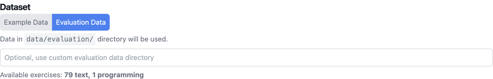
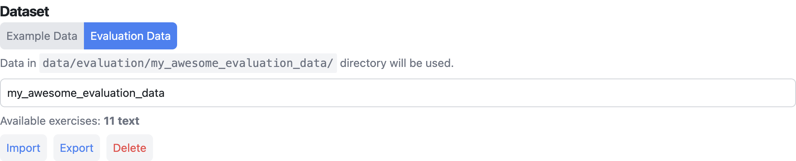

.. _setup_guide:

Setting Up the Playground
========================

Before conducting experiments, ensure the Athena Playground is correctly set up and running.

There are multiple ways of accessing Athena through the Athena Playground:

1. **Test-server setup:**
  - Everything is taken care of, i.e., hosting the Athena Playground and the Athena Modules.
  - The cost for model inference is carried by our organization.
  - You can upload, download, and remove your own evaluation data under a directory name.
  - Keep in mind that the **team can technically access the data on the test-server**. If encrypted/secured evaluation data is needed, you must request it.
  - Request the Athena Playground secret from the team or find it on the team's Confluence.
  - **Playground access:** https://athenetest1-03.ase.cit.tum.de/playground

2. **Local setup:**
  - **Pro:** We cannot access your data this way
  - **Con:** You setup the everything locally, configure the environment, and carry the cost of the models
  - Set up the Athena Assessment Module Manager and all Athena Modules you want to evaluate locally. (See :ref:`setup_install`, then see :ref:`run_local` or see :ref:`run_docker`)
  - In `.env.example`, you will find example environment variables that need to be set in `.env` (duplicate the file, rename it to `.env`, then edit).
  - Run the Athena Playground. (See :ref:`run_playground`)

Connect to Athena Instance through the Playground
--------------------------

1. Open the playground
  - Test-server setup: https://athenetest1-03.ase.cit.tum.de/playground
  - Local setup: http://localhost:3000
2. Up top you see the **Base Info Header** containing all configuration
  .. figure:: ./base_info_header.png
    :width: 800px
    :alt: Base Info Header Interface of the Athena Playground

    Base Info Header Interface of the Athena Playground (local setup)
3. For the test-server setup: **Enter the secret using the provided credentials**
4. Check health of the services
  - Assessment Module Manage has to be green
  - All modules for evaluation have to be green

Loading the Datasets
-----------------------

In the base info header you have the option to select a dataset:

1. **Example Data:** If you just want to experiment with the modules using the example data for testing purposes. 
2. **Evaluation Data:** If you want to use existing or your own evaluation data. 

Default Evaluation Data
^^^^^^^^^^^^^^^^^^^^^^^

When selecting `Evaluation Data` you can see the available exercises in `data/evaluation/` locally or remotely on the test-server (none if there is no configured).

    Evaluation Data Interface of the Athena Playground

Custom Evaluation Data
^^^^^^^^^^^^^^^^^^^^^^^

You can add your own evaluation data like this:

1. Select **Evaluation Data**
2. Enter a directory name for the custom evaluation data, e.g. `my_awesome_evaluation_data`
3. Press **Import** and select the data you want to import (See :ref:`evaluation_data_format_guide`)
  - Select one or multiple `.json` files (in case of non-programming exercises)
  - Alternatively: Select a `.zip` that contains `.json` files and the associated code repositories. **Important:** they have to be on the top level!
4. Verify that it lists `Avaliable exercises:` as expected 
5. Optional: Press **Export** to export the data if needed (The playground does not modify it, currently)
6. Optional: Press **Delete** to delete the data again (Warning: Some data might still exist in the Athena database if it was sent to a module)

  Custom Evaluation Data, `my_awesome_evaluation_data`, in the Athena Playground

Choose Testing Mode
-------------------

- Select between **Module Requests** and **Evaluation Mode** for different testing experiences.

.. tip::
   Module Requests are for testing individual module responses, while Evaluation Mode is for comprehensive experiments.
